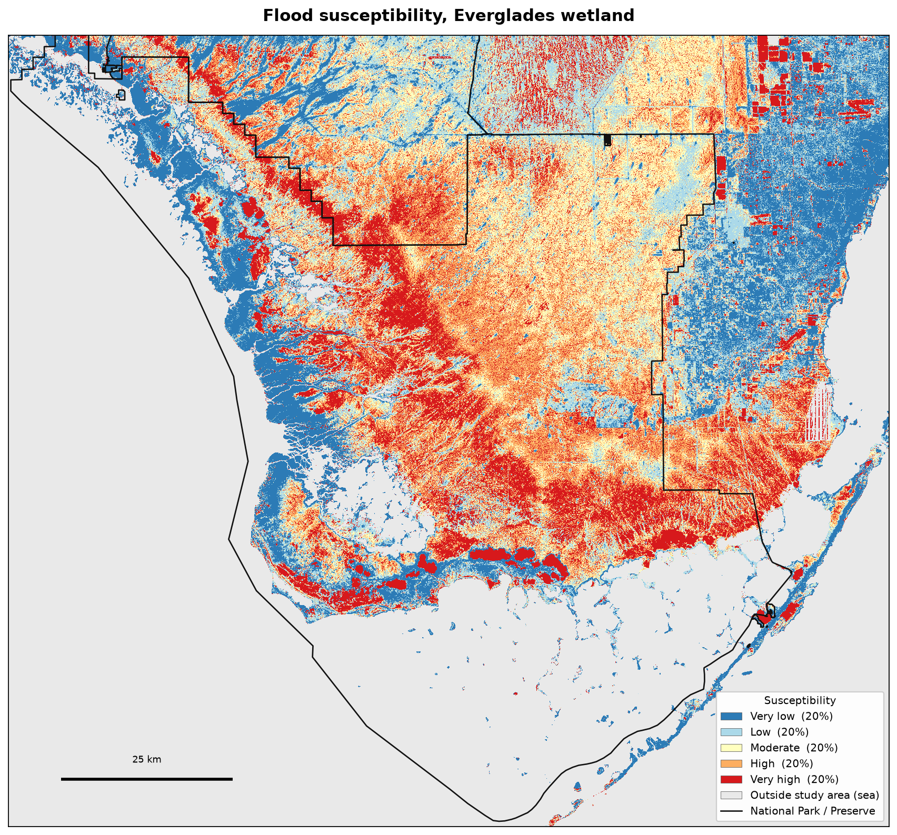
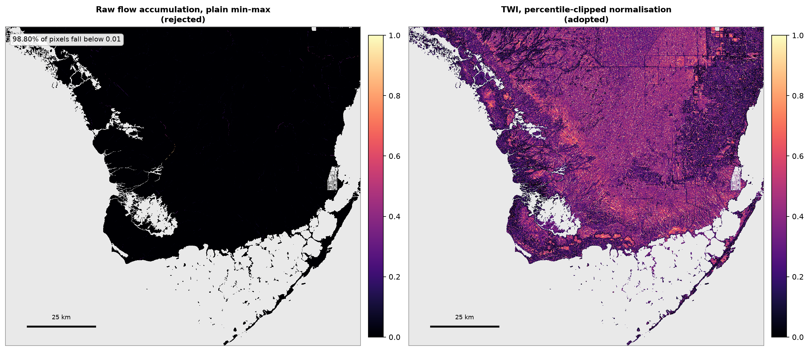
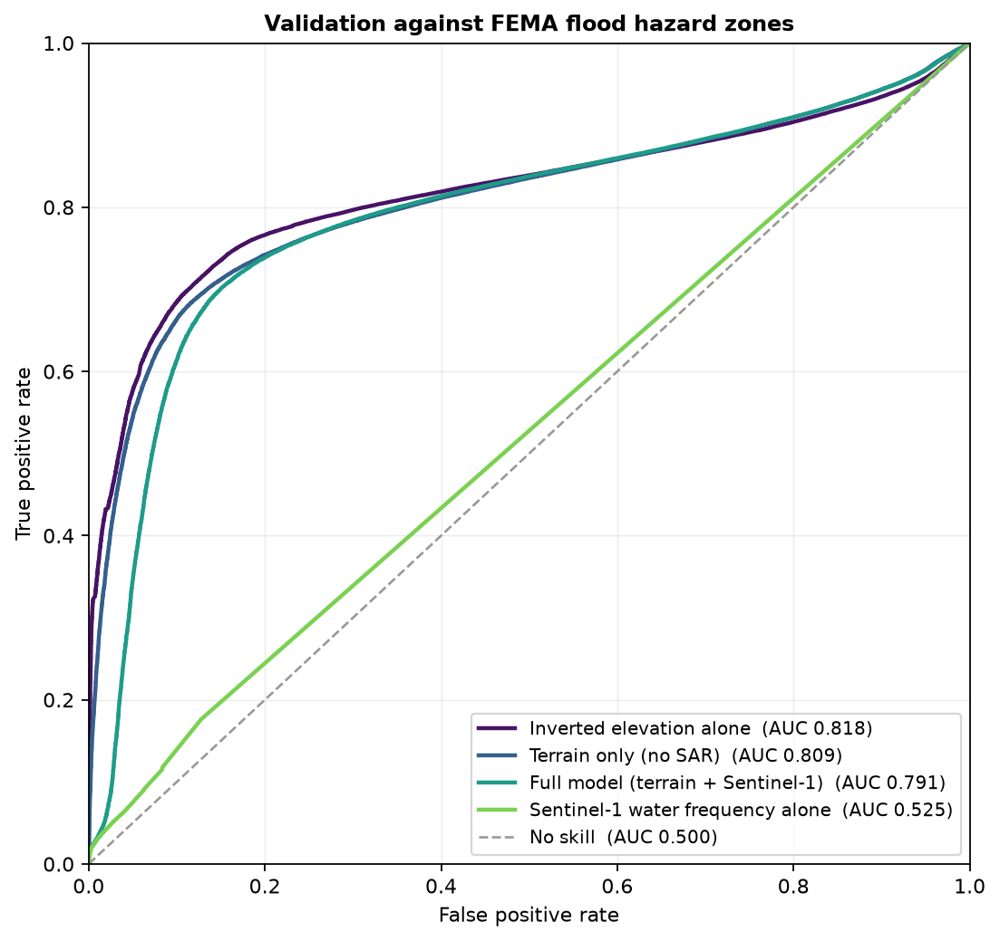
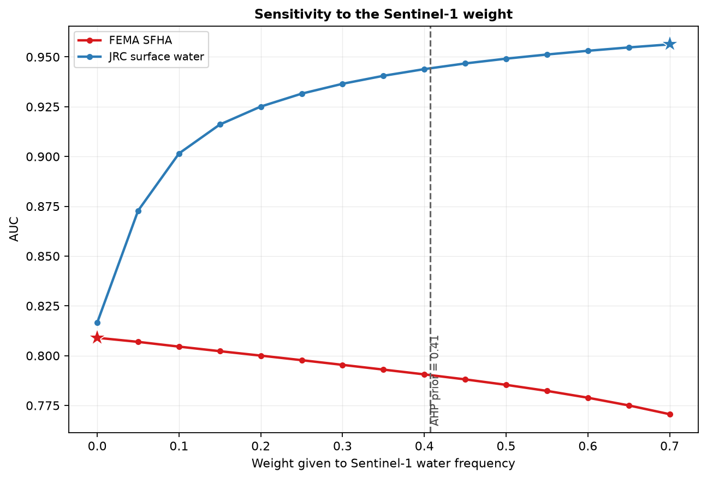
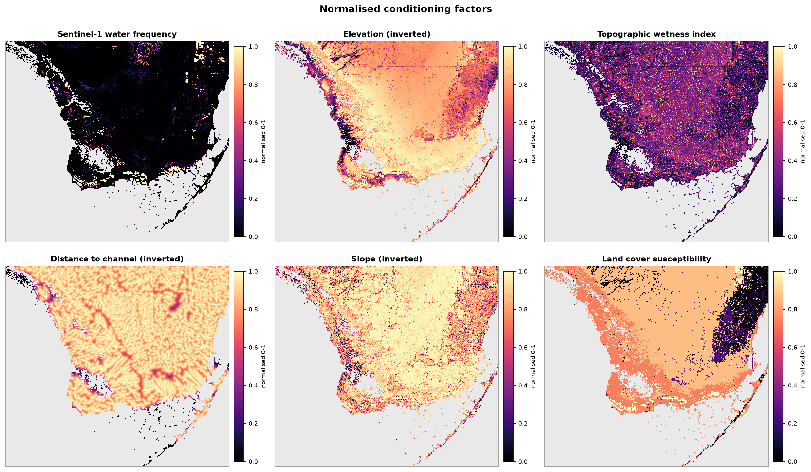
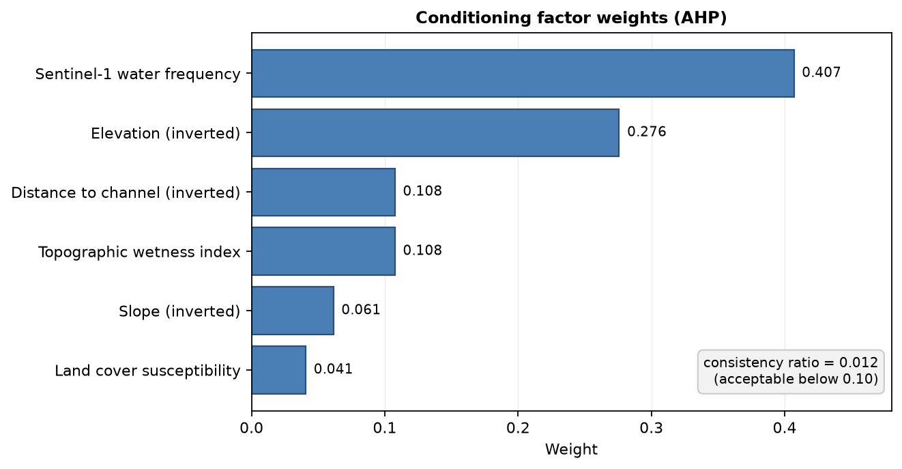

# Flood Susceptibility of the Everglades Wetland

**A reproducible Sentinel-1 + DEM model, validated against independent flood data.**

Six conditioning factors — a year of Sentinel-1 water observations plus five
terrain derivatives — combined through AHP-weighted overlay and scored against
two independent references. Runs end to end with `python run.py`, from open
data, with no credentials.



---

## Findings

**1. A fixed dB threshold cannot detect water in this archive.** Measured over
ESA WorldCover's permanent-water class, the median VV gamma0 of the *same
water* moved from **−23.3 dB** (27 Aug 2023) to **−16.1 dB** (6 Jan 2023) — a
7 dB swing, because wind roughens the surface and Bragg scattering lifts the
return. A −18 dB cut would have labelled 100% of that water correctly in
August and **4.8%** of it in January. Deriving the threshold per scene by
Otsu's method gave values between **−15.0 and −10.5 dB** (median −12.6): the
plausible-looking fixed threshold of −18 dB sits outside the range that was
actually correct for *every* accepted scene.

**2. Raw flow accumulation must not be min-max normalised.** It spans 1 to
187,804 cells with nearly all mass at the bottom. Scale it linearly and
**98.80% of pixels land below 0.01**, leaving a sparse scatter of channel cells
near 1 — salt-and-pepper noise wearing the colours of a hazard map. Entering it
through TWI (logarithmic) with percentile-clipped normalisation recovers the
structure.



**3. FEMA Zone D is "not studied", not "not at risk" — and confusing the two
inverts the validation.** Zone D covers **22.8%** of the study domain, and it
is the lowest, wettest ground in it: median elevation **0.93 m** against 3.99 m
for Zone X, mean surface-water occurrence **12.2%** against 0.3%. It is the
undeveloped interior of Everglades National Park, unmapped because there is no
property there to regulate. Scoring those pixels as negatives put every model
variant *below chance* (AUC **0.456**). Excluding them raised the unchanged
model to **0.791**.

**4. The two references disagree about the model, monotonically.** This is the
most interesting result, and it does not flatter the model.

---

## Validation

| Model | FEMA SFHA | JRC surface water |
| --- | ---: | ---: |
| Full model (terrain + Sentinel-1) | 0.791 | **0.946** |
| Inverted elevation alone | **0.818** | 0.855 |
| Terrain only (no SAR) | 0.809 | 0.817 |
| Sentinel-1 water frequency alone | 0.525 | **0.958** |

Each reference favours the variant most like how the reference itself was
made. FEMA's Special Flood Hazard Area is delineated largely from elevation and
coastal exposure, so **inverted elevation alone beats the full model on it**.
JRC Global Surface Water is an optical water-occurrence product, so the SAR
water layer nearly saturates it.

Neither is ground truth for "flood susceptibility". The SFHA is a regulatory
1%-annual-chance floodplain, mapped to differing standards and vintages by
county; JRC occurrence measures *open water*, not inundation beneath
vegetation. The full model is the only variant that scores well against
**both**.



### Weight sensitivity

Sweeping the Sentinel-1 weight from 0 to 0.7 moves the two references in
exactly opposite directions, with no interior optimum:



| w(SAR) | FEMA SFHA | JRC water |
| ---: | ---: | ---: |
| 0.00 | **0.809** | 0.817 |
| 0.20 | 0.800 | 0.925 |
| **0.41** (AHP prior) | 0.791 | 0.944 |
| 0.70 | 0.771 | **0.956** |

So the weight is not really an empirical question — it is a choice about which
reference you believe. Two things follow, and the second is a criticism of the
model as built:

* The AHP prior is *defensible*: moving from w=0 to w=0.41 costs **−0.018** AUC
  against FEMA and buys **+0.127** against JRC. A small loss on one reference
  for a large gain on the other.
* But the JRC curve is steeply concave, and most of that gain has arrived by
  **w ≈ 0.15–0.20** (+0.108 for only −0.009). **The prior of 0.407 is higher
  than the evidence supports.** It is left at its a priori value rather than
  tuned, because fitting weights to the validation data is how a validation
  stops meaning anything.

### Why the Sentinel-1 layer underperforms its weight

The AHP judgements ranked SAR water frequency first, reasoning that it
*observes* inundation rather than inferring it from the shape of the land. In
this environment that reasoning is only half right.



The water-frequency panel is near-zero across most of the domain (median 0.000,
p75 0.000, mean 0.044). SAR detects *open* water by its specular,
low-backscatter signature — but water beneath emergent sawgrass raises
backscatter through double-bounce with the stems and goes undetected. In a
marsh, the layer behaves as an **open-water mask** rather than a graded
flood-frequency surface. That is exactly why it saturates against JRC, which
also measures open water, and barely discriminates against FEMA.

The layer is nonetheless real and independently corroborated: it correlates
**r = 0.707** with JRC Global Surface Water, built from Landsat by entirely
different means.

---

## Study area

| | |
| --- | --- |
| Extent | −81.52 to −80.25 E, 24.85 to 25.89 N |
| Analysis grid | 4278 × 3847 px at 30 m, EPSG:32617 (UTM 17N) |
| Study domain | 8,161,897 px — the AOI is **50.4% open sea**, excluded |

The AOI is a rectangle over the southern tip of Florida, so it is worth being
precise about what the model actually covers. Of the land domain:

| Cover | Share |
| --- | ---: |
| Herbaceous wetland | 57.3% |
| Mangroves | 23.6% |
| Built-up | 6.1% |
| Tree cover | 5.1% |
| Grassland | 3.9% |
| Inland water | 3.0% |
| Cropland, bare, shrub | 1.0% |

**83.9% is wetland, mangrove or inland water.** The remainder is mostly western
Miami-Dade and Homestead along the eastern edge, plus agricultural land in the
north — included deliberately, because the developed margin is where FEMA has
made detailed flood determinations and is therefore where the validation has
the most to say. Everglades National Park and Big Cypress National Preserve are
outlined on the map above.

Spot checks against known locations:

| Location | Land cover | Elevation |
| --- | --- | ---: |
| Shark River Slough (park core) | Herbaceous wetland | 0.97 m |
| Flamingo, south coast | Mangroves | 2.63 m |
| Homestead | Built-up | 2.26 m |
| Florida Bay, Key Largo | — | excluded as sea |

---

## Data

All openly accessible, no credentials required:

| Dataset | Role |
| --- | --- |
| **Copernicus DEM GLO-30** | Elevation, slope, hydrology |
| **Sentinel-1 RTC** (Planetary Computer) | Water frequency — 119 scenes screened, 29 used |
| **ESA WorldCover 10 m 2021** | Land cover; scene screening; sea connectivity |
| **FEMA National Flood Hazard Layer** | Primary validation (3,980 polygons) |
| **JRC Global Surface Water** | Secondary validation and SAR cross-check |
| **NPS boundaries** | Cartography only |

Sentinel-1 **RTC** rather than raw GRD: radiometric terrain correction,
calibration and geocoding are already applied, and applied identically to every
scene, so none of it can drift between acquisitions.

---

## Method

**Study domain.** Sea is identified as permanent water *connected to the edge of
the AOI*, not as all permanent water, so inland lakes, canals and the Water
Conservation Area impoundments stay in.

**Sentinel-1 water frequency.** For each scene: read VV onto the analysis grid
from the overview nearest 60 m, convert to dB, derive an Otsu threshold, and
screen it. A scene is used only if it covers ≥40% of the grid, ≥20% of its
valid data lies over land, and Otsu separability η ≥ 0.70. **90 of 119 scenes
failed on coverage** — they are corner slivers that see almost nothing but
ocean, where Otsu splits water against itself and water recall collapses to
30–62%, against 96–99% on full-coverage scenes. Water frequency is the share of
accepted looks in which a pixel falls below its own scene's threshold, masked
where fewer than 8 looks exist.

**Terrain.** Sink-filling, D8 routing and flow accumulation via pysheds, over
land only. Slope by Horn's method. Everything in UTM 17N — in a geographic CRS
the pixel is measured in degrees, slope comes out distorted by ~10% along one
axis, and distances are not in metres.

> **A standing caveat.** The Everglades falls on the order of 3 cm per
> kilometre; measured median slope here is **0.29°**, and over half the raw AOI
> sits at exactly 0.00 m. Every one of these algorithms was designed for
> hillslopes. On ground this flat, D8's steepest-descent direction is decided
> as much by DEM noise as by topography. The derivatives are still informative —
> a few centimetres genuinely does decide where water sits in a wetland — but
> this is why AHP ranks slope second-to-last, and why none of this should be
> read as if it were terrain with relief.

**TWI** = ln(a / tan β), with tan β floored at 0.001 rad. Without the floor,
tan β reaches ~1e-6 and a handful of cells acquire astronomical TWI, which
reduces everything else to noise once normalised.

**Weights** from AHP: pairwise judgements on Saaty's 1–9 scale, weights as the
principal eigenvector, consistency ratio **0.0124** (acceptable below 0.10). The
judgements and the reasoning behind each are declared in
[`everglades_flood/ahp.py`](everglades_flood/ahp.py) for a reader to argue with.



**Classification** into five quantile classes. Equal intervals would leave the
upper classes nearly empty on an index this skewed. The trade-off: quantile
classes describe *relative* susceptibility within this study area and cannot be
compared against another region's map.

---

## Limitations

* **Open water ≠ inundation.** The SAR layer under-detects water beneath
  emergent vegetation, which is most of the Everglades. VH polarisation or a
  double-bounce-aware classifier would likely do better.
* **Neither reference is ground truth**, and the model is scored only where
  FEMA has made a determination (77.1% of the domain).
* **No observed flood inventory.** A validated event inventory — rather than a
  regulatory layer and a water-occurrence product — would settle the weight
  question the sensitivity analysis leaves open.
* **One year of Sentinel-1** (2023). Water frequency from a single year
  conflates the annual wet/dry cycle with longer-term regime.
* **Quantile classes** are relative to this AOI.
* AUC is computed on a 500,000-pixel random subsample. Neighbouring pixels are
  spatially autocorrelated, so the effective sample size is far smaller than
  the pixel count and small AUC differences should not be over-read.

---

## Reproducing

Python 3.9+ and about 3 GB of disk for the downloads. No credentials.

```bash
pip install -r requirements.txt
python run.py
```

Every stage caches to `data/interim/`, so a re-run costs only what changed:

```bash
python run.py --force sar      # re-screen the Sentinel-1 archive
python run.py --force all
```

A full cold run takes roughly 15 minutes, most of it downloading. Tests need no
data and no network:

```bash
pytest          # 47 passed
```

---

## Layout

```
everglades_flood/
  config.py        study area, sources, thresholds -- every setting in one screen
  raster.py        the analysis grid; every layer is resampled onto it
  fetch.py         open-data downloads, idempotent
  domain.py        sea removal by connectivity; land cover scoring
  terrain.py       slope, sink-fill, D8 routing, TWI, channel distance
  sar.py           Otsu thresholding, scene screening, water frequency
  ahp.py           pairwise judgements -> weights + consistency ratio
  model.py         normalisation, weighted overlay, classification
  validate.py      FEMA/JRC rasterisation, ROC/AUC
  sensitivity.py   weight sweep against both references
  plotting.py      figures
run.py             the pipeline
tests/             47 tests, no data or network required
outputs/
  figures/         the six figures in this README
  results.json     weights, class breaks, every AUC
  flood_susceptibility_classes.tif
```

---

## Data credits

Copernicus DEM, Sentinel-1 and WorldCover © ESA. Global Surface Water ©
European Commission JRC (Pekel et al. 2016). National Flood Hazard Layer ©
FEMA. Park boundaries © US National Park Service.
